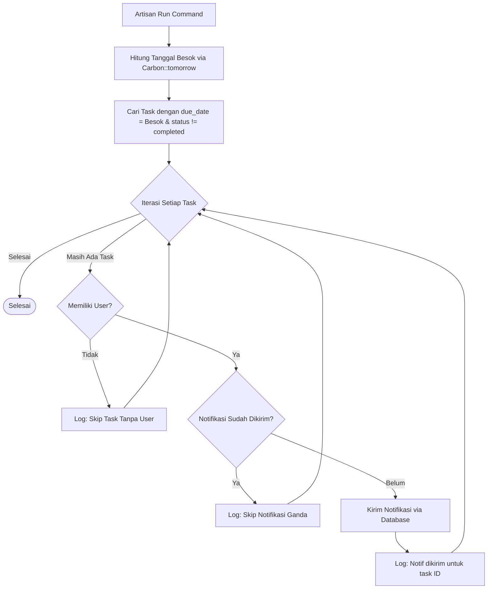

# Dokumentasi Custom Command - ProductivityFlow

Dokumen ini menjelaskan perintah kustom (*Custom Artisan Command*) yang tersedia dalam aplikasi **ProductivityFlow**, yaitu mekanisme pengingat batas waktu tugas (*Deadline Reminder*).

---

## 1. Perintah Pengingat Tenggat Waktu (`deadline:reminder`)

### Deskripsi
Perintah kustom Artisan ini digunakan untuk memindai database secara berkala dan mengirimkan notifikasi pengingat kepada pengguna yang memiliki tugas dengan tanggal jatuh tempo (*due date*) esok hari dan statusnya belum selesai (`completed`).

- **Signature Perintah**: `deadline:reminder`
- **Lokasi File Command**: `app/Console/Commands/SendDeadlineReminder.php`
- **Lokasi File Notifikasi**: `app/Notifications/DeadlineReminder.php`

---

## 2. Cara Kerja di Balik Layar (Logic Under the Hood)

Ketika perintah ini dijalankan, sistem akan mengeksekusi metode `handle()` di `SendDeadlineReminder.php` dengan alur sebagai berikut:



1. **Menghitung Waktu**: Sistem menggunakan `Carbon::tomorrow()` untuk mendapatkan tanggal esok hari.
2. **Kueri Data**: Mengambil seluruh data tugas (`Task`) dengan kriteria:
   - `due_date` sama dengan tanggal besok.
   - `status` tidak sama dengan `completed`.
3. **Validasi User**: Memastikan tugas tersebut terasosiasi dengan user yang valid (`$task->user`).
4. **Pencegahan Duplikasi (Idempotensi Notifikasi)**:
   Sistem memeriksa ke tabel notifikasi apakah notifikasi pengingat untuk tugas tersebut sudah pernah dikirimkan sebelumnya dengan mencocokkan field `task_id` di dalam kolom `data` JSON notifikasi:
   ```php
   $alreadySent = $task->user->notifications()
       ->where('data->task_id', $task->id)
       ->exists();
   ```
5. **Kirim Notifikasi**: Jika belum pernah dikirim, sistem akan memanggil:
   ```php
   $task->user->notify(new DeadlineReminder($task));
   ```
   Notifikasi ini disimpan ke dalam database (tabel `notifications`) melalui channel `database` bawaan Laravel dengan payload JSON berikut:
   ```json
   {
       "task_id": 12,
       "title": "Reminder Task ",
       "message": "Task \"Desain Wireframe Dashboard\" is approaching its deadline",
       "deadline": "2026-06-09"
   }
   ```

---

## 3. Cara Menjalankan Perintah

### A. Menjalankan Secara Manual (Manual Execution)
Anda dapat memicu jalannya pengingat secara manual kapan saja dari terminal proyek menggunakan perintah berikut:
```bash
php artisan deadline:reminder
```

**Output Terminal jika berhasil**:
```text
Jumlah task ketemu: 2
Notif dikirim untuk task ID: 12
Notif dikirim untuk task ID: 15
Deadline reminder selesai!
```

### B. Otomatisasi Terjadwal (Laravel Scheduler)
Aplikasi telah mendaftarkan perintah ini di dalam penjadwal bawaan Laravel (*Laravel Scheduler*). 

- **Lokasi Registrasi**: `routes/console.php`
- **Konfigurasi Jadwal**:
  ```php
  Schedule::command('deadline:reminder')->dailyAt('08:00');
  ```
  Ini berarti perintah akan otomatis dieksekusi **setiap hari pada pukul 08:00 pagi**.

Agar Scheduler berjalan secara otomatis di server produksi, Anda perlu menambahkan satu baris entri cronjob di server Anda:
```cron
* * * * * cd /path-to-your-project && php artisan schedule:run >> /dev/null 2>&1
```

---

## 4. Panduan Pengujian & Simulasi (Testing Guide)

Untuk memverifikasi apakah fitur pengingat ini berfungsi dengan baik, ikuti langkah-langkah simulasi berikut:

1. **Buat Data Uji**:
   - Masuk ke aplikasi dan buatlah sebuah tugas (*Task*) baru.
   - Set tanggal jatuh tempo (*due date*) tugas tersebut tepat **esok hari**.
   - Biarkan status tugas tetap **Pending** (jangan centang selesai).
2. **Jalankan Perintah**:
   Buka terminal dan jalankan:
   ```bash
   php artisan deadline:reminder
   ```
3. **Verifikasi Notifikasi**:
   - **Melalui Database**: Periksa tabel `notifications` di database Anda. Pastikan baris notifikasi baru dengan `type` berisi `App\Notifications\DeadlineReminder` telah berhasil dibuat.
   - **Melalui UI Aplikasi**: Masuk ke Dashboard atau halaman lainnya, klik ikon lonceng notifikasi di bagian header, lalu pastikan notifikasi pengingat muncul di daftar dropdown.
