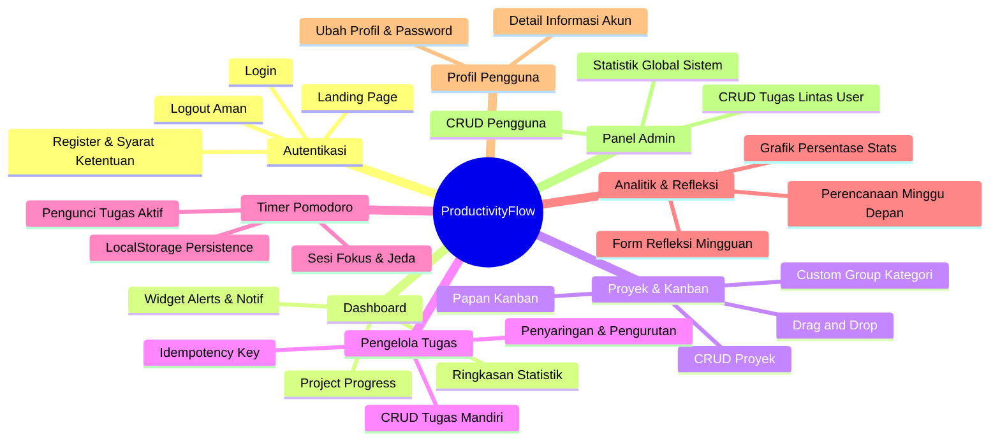

# Dokumentasi Fitur - ProductivityFlow

Aplikasi **ProductivityFlow** adalah platform manajemen produktivitas komprehensif yang dirancang untuk membantu pengguna mengelola tugas (*tasks*), mengorganisasi proyek (*projects*), fokus bekerja menggunakan metode Pomodoro (*focus session*), serta merefleksikan kemajuan mingguan (*weekly analytics*).

Dokumen ini menjelaskan rincian teknis dan fungsionalitas dari setiap fitur yang ada dalam aplikasi.

---

## Daftar Fitur Aplikasi

---

## 1. Pendaratan & Autentikasi (Landing & Authentication)

### Deskripsi
Gerbang awal aplikasi untuk mengenalkan platform kepada pengunjung umum dan menyediakan akses masuk aman ke dalam dashboard.

* **URL Routing**:
  - Landing Page: `/`
  - Login: `/login` (View: `auth.login`)
  - Register: `/register` (View: `auth.register`)
* **Controller**: `App\Http\Controllers\AuthController.php`
* **Fitur Utama**:
  - **Landing Page Dinamis**: Menampilkan ringkasan visual fitur, keunggulan aplikasi, serta call-to-action (CTA) untuk mendaftar.
  - **Sistem Registrasi**: Memeriksa kelayakan data (nama, email unik belum terdaftar, kata sandi minimal 8 karakter dengan konfirmasi kecocokan, serta kewajiban menyetujui Syarat & Ketentuan). Setelah pendaftaran sukses, user akan otomatis login.
  - **Sistem Login Keamanan**: Autentikasi email & password dengan penanganan error validasi yang ramah pengguna. Menggunakan `Session::regenerate()` setelah login sukses untuk menghindari celah keamanan *session fixation*.
  - **Secure Logout**: Tombol keluar menggunakan request `POST` untuk menginvalidaasi session pengguna secara aman dan meregenerasi CSRF token.

---

## 2. Dashboard Utama (Main Dashboard)

### Deskripsi
Pusat kendali dan ringkasan produktivitas harian bagi pengguna setelah berhasil masuk ke sistem.

* **URL Routing**: `/dashboard` (View: `dashboard.blade.php`)
* **Fitur Utama**:
  - **Statistik Cepat (Weekly Summary)**: Menampilkan total tugas, tugas selesai, tugas tertunda, dan rasio penyelesaian tugas.
  - **Progress Proyek**: Menampilkan daftar proyek yang sedang aktif beserta progress bar persentase penyelesaian tugas di dalam proyek tersebut secara visual.
  - **Productivity Score**: Menampilkan nilai indeks produktivitas mingguan berdasarkan rasio penyelesaian tugas.
  - **Recent Alerts**: Menampilkan tugas-tugas darurat (*Urgent*) yang mendekati tenggat waktu secara real-time.
  - **Header Navigasi**:
    - *Notifikasi Dropdown*: Akses ringkas ke notifikasi pengingat tenggat waktu.
    - *Profil Dropdown*: Jalan pintas menuju halaman `/profile` atau memicu *Logout*.

---

## 3. Manajemen Proyek & Papan Kanban (Project Management)

### Deskripsi
Fitur pengorganisasian tugas ke dalam lingkup proyek terstruktur dengan visualisasi interaktif papan Kanban.

* **URL Routing**: `/projects` (View: `projects.blade.php`)
* **Controller**: `App\Http\Controllers\ProjectController.php` & `App\Http\Controllers\TaskController.php`
* **Berkas Javascript**: `public/js/projects.js`
* **Fitur Utama**:
  - **CRUD Proyek**: Membuat proyek dengan nama, deskripsi, dan status (`active`, `completed`, `archived`).
  - **Kategori & Custom Group**: Pengguna dapat mengelompokkan proyek berdasarkan kategori bawaan (seperti *Work*, *School*, *Personal*, dll.) atau mendefinisikan kategori baru (*Custom Group*). Data pengelompokan ini disimpan di LocalStorage dengan key:
    - `pf_project_groups` (Memetakan Project ID ke nama grup)
    - `pf_custom_groups` (Daftar nama grup kustom yang dibuat user)
  - **Papan Kanban Interaktif**: Saat proyek dibuka, sistem menyajikan tugas dalam format papan Kanban dengan tiga kolom:
    - **To Do**
    - **In Progress**
    - **Done**
  - **Drag and Drop Tasks**: Pengguna dapat memindahkan kartu tugas antar kolom status secara visual. Status baru akan disimpan di database (mengubah status task menjadi `completed` jika didrop ke *Done*, atau `pending` jika dipindahkan kembali) serta dicatat di LocalStorage (`pf_kanban_status`).
  - **Tambah Tugas Proyek**: Pengguna dapat langsung menambahkan tugas baru yang secara otomatis memiliki relasi dengan proyek aktif (`project_id`).

---

## 4. Pengelola Tugas (Task Manager)

### Deskripsi
Modul pengelolaan tugas individual (mandiri) untuk membantu memantau daftar pekerjaan secara terperinci.

* **URL Routing**: `/task-manager` (View: `task-manager.blade.php`)
* **Controller**: `App\Http\Controllers\TaskController.php`
* **Fitur Utama**:
  - **CRUD Tugas**: Pengguna dapat menambahkan tugas mandiri dengan atribut: Judul, Deskripsi, Kategori (`work`, `personal`, `learning`, `health`), Prioritas (`low`, `medium`, `high`), dan Tanggal Tenggat (*due date*).
  - **Pencegahan Double Submit (Idempotency Key)**:
    Request pengiriman data tugas ke backend mengirimkan header `X-Idempotency-Key` yang divalidasi oleh backend Laravel. Jika ada pengiriman ganda akibat koneksi lambat, server akan mengembalikan data yang sudah tersimpan di cache tanpa memproses pembuatan ulang data duplikat di database.
  - **Penyelesaian Cepat (Instant Checkbox)**: Pengguna dapat mencentang checkbox pada kartu tugas untuk menandai selesai secara instan. Status tugas disinkronkan ke database dan status statis di dashboard langsung diperbarui secara asinkron (AJAX).
  - **Penyaringan & Pengurutan**:
    - Filter kategori di sidebar kiri (Menampilkan kategori tugas tertentu).
    - Filter status (Semua tugas, Tugas Aktif, Tugas Selesai).
    - Sorting dropdown di kanan atas (Berdasarkan: Terbaru dibuat, Prioritas tertinggi, atau Batas Waktu terdekat).

---

## 5. Ruang Kerja Fokus (Focus Workspace / Pomodoro)

### Deskripsi
Ruang kerja minim gangguan yang memanfaatkan teknik Pomodoro untuk melatih fokus pengguna pada tugas spesifik.

* **URL Routing**: `/focus` (View: `focus.blade.php`)
* **Fitur Utama**:
  - **Timer Pomodoro Multi-Mode**: 
    - *Pomodoro Session* (25 menit - Fokus bekerja)
    - *Short Break* (5 menit - Jeda istirahat singkat)
    - *Long Break* (15 menit - Jeda istirahat panjang)
  - **Kustomisasi Durasi**: Pengguna dapat mengatur durasi kustom untuk masing-masing mode melalui modal pengaturan.
  - **Pengunci Tugas Fokus (Focus Target)**: Pengguna dapat menginput atau memilih tugas apa yang sedang ia kerjakan saat itu. Tugas akan dikunci pada panel atas untuk menghindari distraksi.
  - **Ketahanan State Timer (Anti-Reset)**:
    Menggunakan kalkulasi matematika `expectedEndTime` yang disimpan di `localStorage`. Apabila browser tidak sengaja tertutup, di-refresh, atau dialihkan ke halaman lain, waktu timer tetap berjalan secara akurat ketika halaman dibuka kembali.
  - **Riwayat Sesi Fokus**: Mencatat total menit fokus harian dan riwayat 4 sesi fokus terakhir yang berhasil diselesaikan di panel kanan.

---

## 6. Analitik Mingguan & Refleksi (Weekly Analytics)

### Deskripsi
Halaman evaluasi mingguan untuk melihat performa produktivitas melalui visualisasi grafik dan membuat jurnal refleksi diri serta perencanaan terstruktur.

* **URL Routing**: `/analytics` (View: `analytics.blade.php`)
* **Fitur Utama**:
  - **Visualisasi Kemajuan Tugas**: Menampilkan diagram lingkaran (donut chart) dinamis yang menggambarkan proporsi tugas selesai, sisa tugas, dan kategori tugas yang paling mendominasi. Data diperoleh dari API statistik `/api/tasks/stats`.
  - **Navigasi Rentang Minggu**: Pengguna dapat bergeser ke minggu sebelumnya atau minggu berikutnya untuk melihat data historis.
  - **Jurnal Refleksi Mingguan**: Menyediakan form refleksi mencakup:
    - *What Went Well* (Apa saja pencapaian yang berjalan lancar minggu ini)
    - *Challenges* (Tantangan atau hambatan utama yang dihadapi)
    - *Lessons Learned* (Pelajaran berharga yang didapatkan)
  - **Perencanaan Minggu Depan**: Menyediakan form perencanaan mencakup:
    - *Top 3 Priorities* (Prioritas utama ke-1, ke-2, dan ke-3 untuk minggu depan)
    - *Main Focus* (Fokus utama kategori, misalnya: Studi, Pekerjaan, dll.)
  - **Penyimpanan Lokal Terstruktur**: Data refleksi dan perencanaan disimpan di LocalStorage dengan key yang diidentifikasi berdasarkan rentang tanggal mingguan (sehingga data refleksi minggu lalu tidak akan tertimpa oleh minggu ini).

---

## 7. Manajemen Profil (Profile Management)

### Deskripsi
Panel kontrol bagi pengguna untuk melihat informasi data diri pribadi, melacak statistik karir produktivitas mereka, serta memperbarui akun keamanan.

* **URL Routing**: `/profile` (View: `profile.blade.php`)
* **Fitur Utama**:
  - **Ringkasan Akun**: Menampilkan Nama Pengguna, Alamat Email, Peran (*Role*), Tanggal Bergabung, dan Status Aktivitas Terakhir.
  - **Statistik Penyelesaian Akun**: Menampilkan rasio kelulusan/penyelesaian seluruh tugas yang pernah dibuat oleh pengguna dalam bentuk grafik lingkaran persentase kemajuan.
  - **Update Profil**: Menyediakan modal form untuk memperbarui Nama Lengkap dan Alamat Email pengguna.
  - **Ubah Kata Sandi Aman**: Pengguna dapat mengubah password mereka dengan keamanan ekstra, di mana backend akan memvalidasi *Password Saat Ini* terlebih dahulu untuk memverifikasi kepemilikan sebelum password baru dapat disimpan.

---

## 8. Panel Administrator (Admin Panel - Khusus Admin)

### Deskripsi
Halaman manajemen kontrol terpusat yang hanya dapat diakses oleh user dengan status `is_admin = true` di database. Fitur ini dirancang untuk pengawasan dan moderasi seluruh sistem.

* **URL Routing & Views**:
  - Dashboard Admin: `/admin` (View: `admin.dashboard`)
  - Kelola Pengguna: `/admin/users` (View: `admin.users`)
  - Kelola Tugas Global: `/admin/tasks` (View: `admin.tasks`)
* **Controller**: `App\Http\Controllers\AdminController.php` (dilindungi middleware `admin`)
* **Fitur Utama**:
  - **Dashboard Statistik Global**: Menyajikan data total user terdaftar di sistem, total tugas terhitung di sistem, rasio penyelesaian tugas global, daftar 5 pengguna terbaru, dan daftar 5 tugas terbaru yang dibuat di seluruh sistem.
  - **Manajemen Pengguna (User Management CRUD)**:
    - Melihat daftar semua user beserta jumlah tugas yang dibuat masing-masing user.
    - Membuat user baru dari admin panel.
    - Mengedit informasi nama, email, password, serta mengubah status hak akses peran (*is_admin*) milik user lain.
    - Menghapus akun user (Penghapusan user otomatis menghapus tugas-tugas milik user tersebut melalui relasi DB Cascade). Terdapat validasi pencegahan agar admin tidak dapat menghapus akunnya sendiri yang sedang digunakan.
  - **Manajemen Tugas Global (Global Task CRUD)**:
    - Melihat daftar seluruh tugas di sistem lintas pengguna (*cross-user*).
    - Membuatkan tugas baru untuk user tertentu yang dipilih.
    - Mengedit judul, deskripsi, prioritas, kategori, deadline, status (`pending`/`completed`), atau mengganti kepemilikan tugas ke user lain.
    - Menghapus tugas apa saja dari sistem database.
