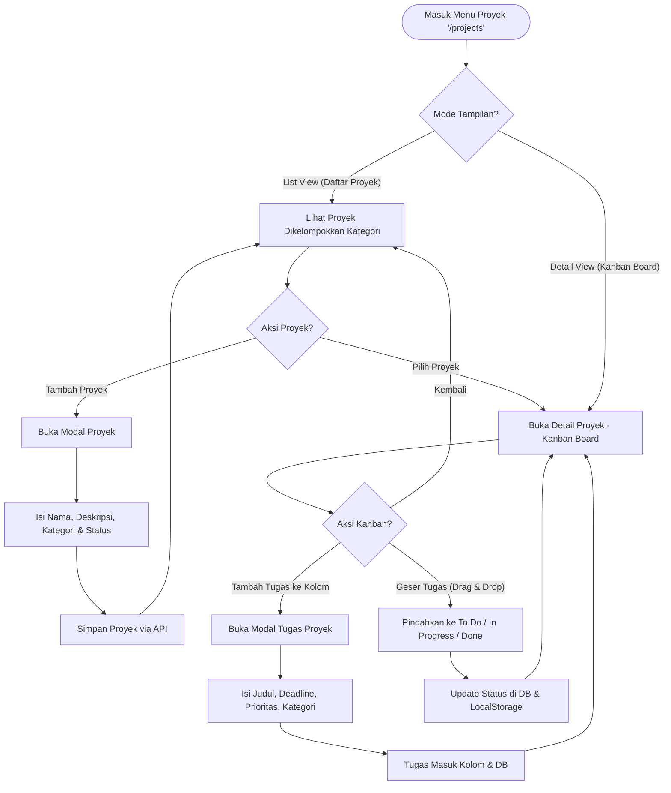
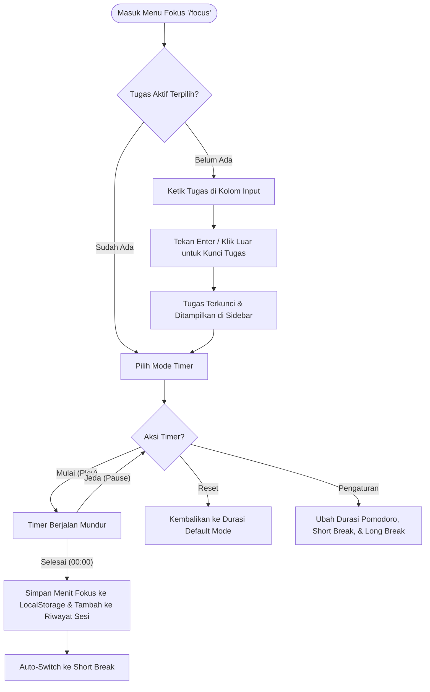

# User Flow - ProductivityFlow

Dokumen ini menjelaskan alur pengguna (user flow) dari awal hingga akhir untuk aplikasi **ProductivityFlow**, mulai dari proses autentikasi hingga pengelolaan tugas, proyek, fokus, dan analitik.

---

## 1. Landing & Authentication Flow (Alur Pendaratan & Autentikasi)

Alur ini mengatur bagaimana pengguna baru maupun pengguna terdaftar berinteraksi dengan gerbang awal aplikasi.

```mermaid
graph TD
    Start([Pengunjung Masuk Landing Page '/']) --> Choice{Ingin Masuk atau Daftar?}
    Choice -- Masuk (Login) --> LoginRoute[/login]
    Choice -- Daftar (Register) --> RegisterRoute[/register]
    
    LoginRoute --> FillLogin[Isi Email & Password]
    FillLogin --> SubmitLogin{Submit Form}
    SubmitLogin -- Validasi Gagal / Salah Credential --> ShowLoginError[Tampilkan Error Form]
    ShowLoginError --> FillLogin
    SubmitLogin -- Sukses --> AuthUser[Log In User + Regenerate Session] --> DashboardRedirect[Redirect ke '/dashboard']
    
    RegisterRoute --> FillRegister[Isi Nama, Email, Password, Konfirmasi, & Syarat Ketentuan]
    FillRegister --> SubmitRegister{Submit Form}
    SubmitRegister -- Email Terdaftar / Password < 8 Karakter / Konfirmasi Salah --> ShowRegError[Tampilkan Error Form]
    ShowRegError --> FillRegister
    SubmitRegister -- Sukses --> CreateUser[Buat User Baru + Log In Otomatis] --> DashboardRedirect
```

* **Landing Page (`/`)**: Menampilkan fitur utama (*Task Manager*, *Focus Session*, *Habit Tracker*, *Insights*), cara kerja, serta statistik publik (jumlah pengguna aktif, menit fokus, rating, dll).
* **Login (`/login`)**: Validasi dilakukan oleh `AuthController@login`. Jika berhasil, session diperbarui dan pengguna diarahkan ke `/dashboard`.
* **Register (`/register`)**: Memeriksa nama, keunikan email, panjang kata sandi minimal 8 karakter, konfirmasi kata sandi, dan persetujuan syarat ketentuan. Jika berhasil, data disimpan di database, pengguna otomatis masuk, dan diarahkan ke `/dashboard`.
* **Logout (`/logout`)**: Mengirimkan request POST, menghapus session aktif, meregenerasi token CSRF, dan mengembalikan pengguna ke landing page (`/`).

---

## 2. Dashboard Flow (Alur Dashboard Utama)

Dashboard utama adalah pusat informasi ringkas tentang produktivitas harian dan mingguan pengguna.

* **Akses (`/dashboard`)**: Dilindungi middleware `auth`.
* **Alur Tampilan**:
  1. Pengguna melihat **Ringkasan Mingguan** (*Total Tasks*, tugas selesai, tugas tertunda, dan persentase kelayakan).
  2. **Task Overview**: Distribusi status tugas (*Urgent*, *In Progress*, *Completed*).
  3. **Recent Alerts**: Pemberitahuan/peringatan penting (misal: deadline mendekat).
  4. **Project Progress**: Status kemajuan proyek aktif dalam bentuk bar persentase.
  5. **Productivity Score**: Skor nilai mingguan produktivitas pengguna.
* **Navigasi Konten**:
  * Klik ikon Notifikasi (lonceng) di Header -> Membuka dropdown notifikasi.
  * Klik Avatar / Nama User di Header -> Membuka menu dropdown untuk mengakses `/profile` atau menekan tombol *Logout*.
  * Gunakan Search Bar di Header -> Pencarian cepat di seluruh tugas/proyek.

---

## 3. Project Management Flow (Alur Pengelolaan Proyek)

Halaman ini memungkinkan pengguna mengatur tugas-tugas dalam bentuk proyek dengan visualisasi Kanban Board.



* **Daftar Proyek (List View)**:
  * Proyek dikelompokkan berdasarkan kategori grup (bawaan seperti *Work*, *School*, *Personal*, dll., atau grup kustom baru yang didefinisikan pengguna).
  * Pengguna bisa menambah proyek baru melalui modal dengan data: Nama, Deskripsi, Grup, dan Status (`active`, `completed`, `archived`).
* **Papan Kanban (Detail View)**:
  * Membuka papan Kanban yang memiliki tiga kolom status: **To Do**, **In Progress**, dan **Done**.
  * **Sinkronisasi Status**: Perubahan status tugas di Kanban menggunakan drag-and-drop dan menyinkronkan statusnya dengan database serta `localStorage` (`pf_kanban_status`).
  * **Tambah Tugas dalam Proyek**: Menambahkan tugas baru yang langsung terasosiasi dengan proyek ini.

---

## 4. Task Manager Flow (Alur Pengelola Tugas)

Halaman ini berfokus pada manajemen tugas individual secara komprehensif.

* **Akses (`/task-manager`)**: Dilindungi middleware `auth`.
* **Alur Pengelolaan Tugas**:
  1. **Tambah Tugas**: Klik "Tambah Task" -> Modal terbuka -> Pengguna mengisi Judul, Deskripsi, Kategori (*Work*, *Personal*, *Learning*, *Health*), Prioritas (*High*, *Medium*, *Low*), Deadline, dan Proyek Terkait (opsional) -> Submit.
     * *Catatan Teknis*: Dilengkapi dengan pencegahan submisi ganda melalui header `X-Idempotency-Key` yang divalidasi oleh backend.
  2. **Tandai Selesai**: Klik tombol "Tandai Selesai" pada kartu tugas -> Status berubah menjadi `completed`, kartu diperbarui secara real-time, dan statistik sidebar diperbarui.
  3. **Edit Tugas**: Klik ikon pensil -> Modal edit terbuka dengan data tugas terisi -> Lakukan perubahan -> Simpan.
  4. **Hapus Tugas**: Klik ikon tempat sampah -> Muncul konfirmasi -> Konfirmasi disetujui -> Tugas dihapus dari database dan halaman diperbarui.
* **Penyaringan & Pengurutan**:
  * Pengguna dapat memfilter berdasarkan Status (Semua, Aktif, Selesai) dan Kategori di sidebar kiri.
  * Pengguna dapat mencari kata kunci spesifik di kolom pencarian.
  * Pengguna dapat mengurutkan tugas berdasarkan Terbaru, Prioritas, atau Deadline di dropdown kanan atas.

---

## 5. Focus Workspace Flow (Alur Fokus & Timer Pomodoro)

Workspace yang dirancang bebas gangguan untuk membantu pengguna bekerja dengan teknik Pomodoro.



* **Penetapan Tugas**: Pengguna memasukkan apa yang sedang dikerjakan. Tugas akan dikunci dan ditampilkan di header timer serta sidebar kanan agar pengguna tetap ingat targetnya.
* **Mode Timer**: Terdiri dari **Pomodoro** (25 menit), **Short Break** (5 menit), dan **Long Break** (15 menit).
* **Kontrol Timer**: Tombol Mulai/Jeda, Reset, dan Pengaturan.
* **Penyimpanan Sesi & Kontinuitas**:
  * Jika sesi Pomodoro selesai (mencapai 00:00), data menit fokus ditambahkan ke total harian dan riwayat sesi terakhir (maksimal 4 sesi ditampilkan).
  * Sistem menggunakan kalkulasi `expectedEndTime` di `localStorage`. Jika tab ditutup atau dialihkan, timer tetap berjalan secara matematis ketika pengguna kembali ke tab tersebut.

---

## 6. Analytics Flow (Alur Analitik Mingguan)

Halaman untuk mengevaluasi pencapaian mingguan dan menyusun rencana minggu berikutnya.

* **Navigasi Mingguan**: Pengguna menggunakan tombol navigasi panah kiri/kanan untuk memilih minggu. Data refleksi mingguan disimpan di `localStorage` per rentang tanggal.
* **Visualisasi & Insight**:
  * Menampilkan jumlah target selesai, tugas selesai, skor produktivitas, sesi fokus, serta grafik lingkaran (donut chart) kemajuan mingguan secara dinamis dari API `/api/tasks/stats`.
* **Refleksi Mingguan**: Pengguna mengisi formulir:
  * *What Went Well* (Apa yang berjalan dengan baik)
  * *Challenges* (Tantangan)
  * *Lessons Learned* (Pelajaran yang didapat)
* **Perencanaan Minggu Depan**: Pengguna mengisi:
  * Prioritas 1, 2, dan 3.
  * *Main Focus* (Fokus utama, contoh: Study, Project, Work, dll.).
* **Penyimpanan**: Menekan "Save Summary" untuk menyimpan ke `localStorage` atau "Reset Form" untuk menghapusnya.

---

## 7. Profile Management Flow (Alur Manajemen Profil)

Halaman untuk melihat statistik akun pribadi serta memperbarui informasi profil.

* **Akses (`/profile`)**: Menampilkan ringkasan profil, detail akun (Username, Email, Role, Tanggal bergabung, Aktivitas Terakhir), persentase tingkat penyelesaian tugas, dan navigasi cepat.
* **Edit Profile**:
  1. Klik "Edit Profile" -> Modal edit terbuka.
  2. Pengguna dapat memperbarui Nama Lengkap, Email, Kata Sandi Saat Ini, dan Kata Sandi Baru.
  3. Klik "Save Changes" -> Menyimpan pembaruan dan menutup modal.
